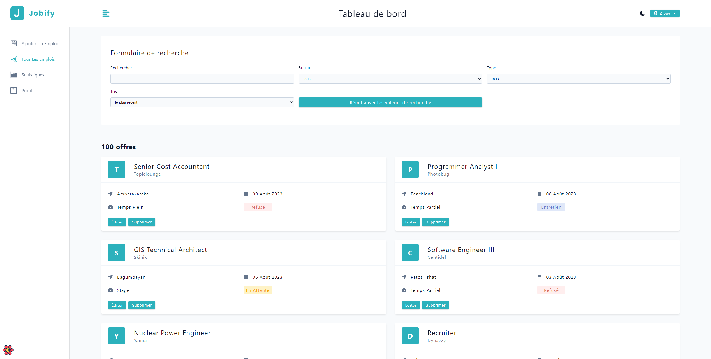

[](https://opensource.org/licenses/ISC)
[](https://jobify-jaj4.onrender.com/)

# MERN Jobify

## [Demo](https://jobify-jaj4.onrender.com/)

## Project description

MERN Jobify is a job search platform built using the MERN stack (MongoDB, Express.js, React, Node.js). It enables employers to publish job offers and job seekers to apply to these offers. The project aims to simplify the recruitment process by providing an intuitive user interface and robust functionality.

## Features

- Publication of job offers
- Job search
- Apply for jobs
- Manage user profiles
- etc...

## Screenshots



## Table of contents

- [Technologies used](#technologies-used)
- [Installation](#installation)
- [Usage](#usage)
- [License](#license)
- [Contact](#contact)

## Technologies used

- MongoDB
- Express.js
- React
- Node.js

## Installation

- Copy the `.env.example` file and rename it to `.env`. Fill in the necessary environment variables.

```bash
# .env.example
NODE_ENV=development
PORT=5000
MONGO_URL=your_mongodb_uri_here
JWT_SECRET=your_jwt_secret_here
JWT_EXPIRES_IN=30d
CLOUD_NAME=your_cloud_name_here
CLOUD_API_KEY=your_cloud_api_key_here
CLOUD_API_SECRET=your_cloud_api_secret_here
```

- Clone the repository and install the dependencies.

```bash
git clone https://github.com/Fixito/mern-jobify.git
cd mern-jobify
npm run setup-project
```

## Usage

To start the development server :

```bash
npm run dev
```

## License

This project is licensed under the ISC License.

## Contact

If you have any questions, please contact me at [thomas_3004@hotmail.fr](mailto:thomas_3004@hotmail.fr)
